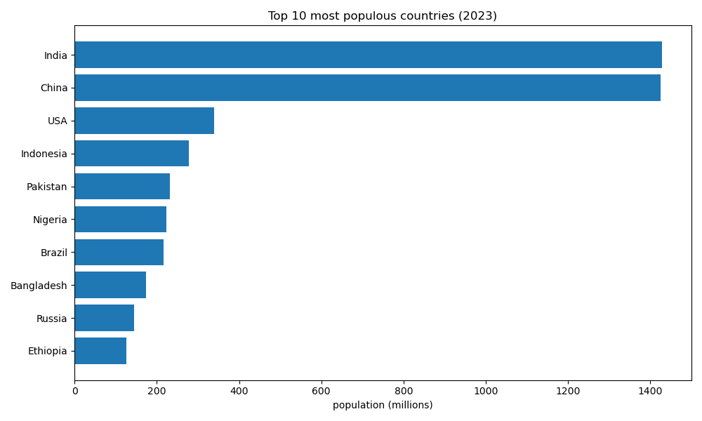
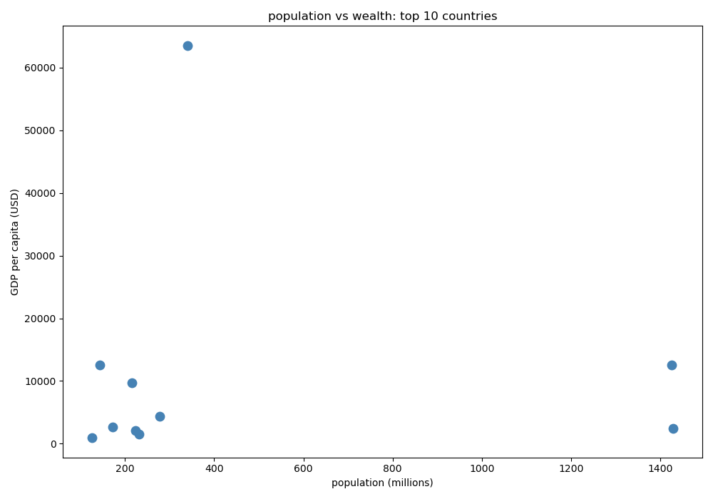

# World Population Analysis

A beginner data science project analyzing the world's 
10 most populous countries using Python.

## Libraries Used
- Pandas — data loading and manipulation
- NumPy — statistical calculations
- Matplotlib — data visualization

## What I Analyzed
- Population and GDP data for 10 countries
- Filtered countries with population above 300 million
- Grouped data by continent
- Built a bar chart and scatter plot

## Key Insights
- India and China together hold nearly half the world's population
- USA has the highest GDP per capita at $63,544
- Having a large population does not mean higher wealth per citizen

## Charts

